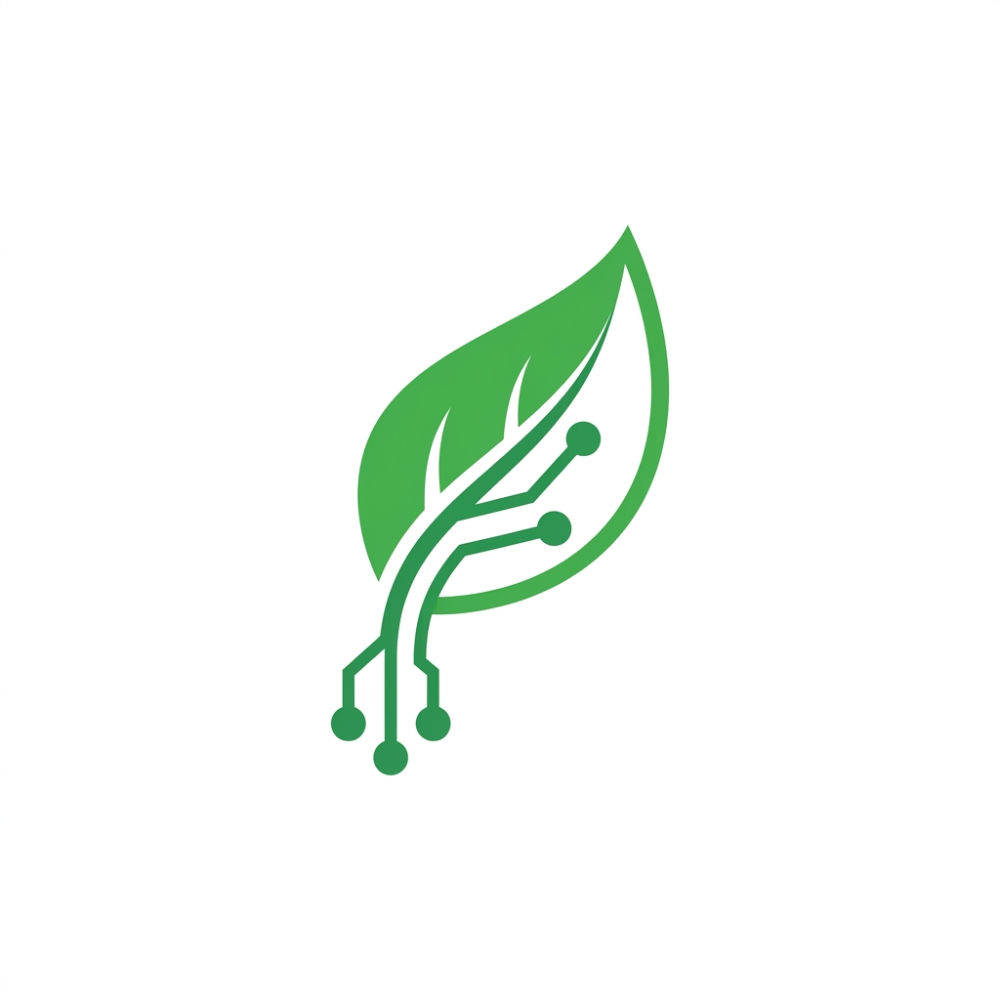
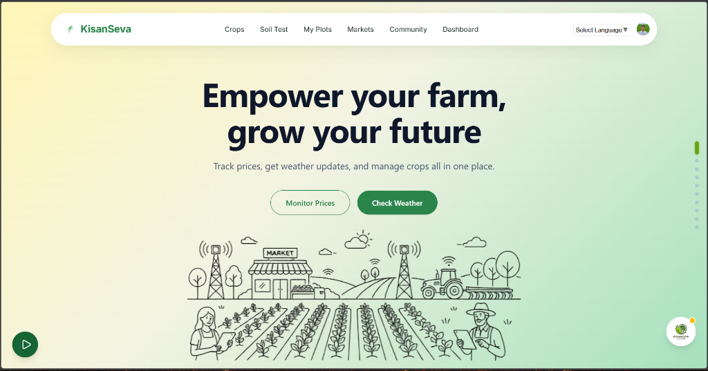
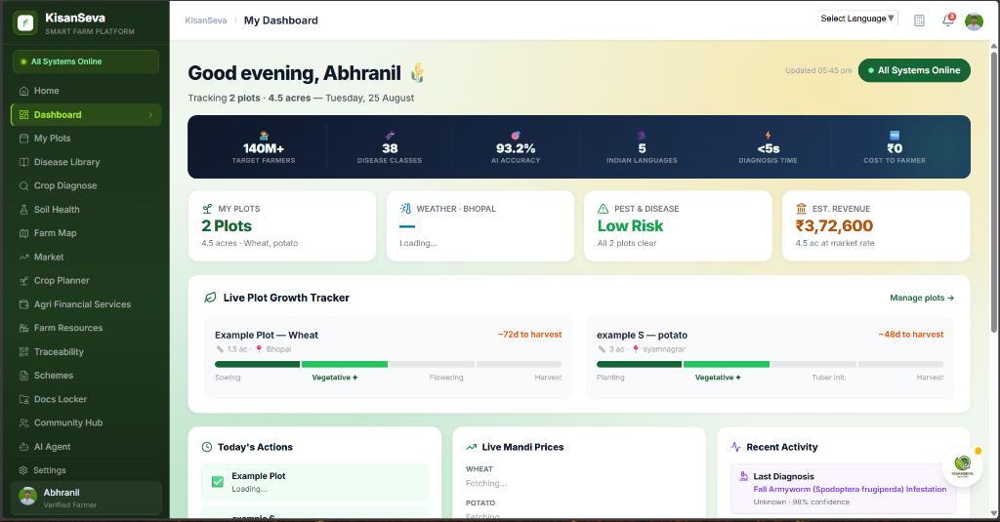

## 🎥 KisanSeva Vision Trailer

Watch our short concept trailer introducing the vision behind KisanSeva:

[**▶️ Watch the Project Trailer (Google Drive)**](https://drive.google.com/drive/folders/1qclB5-O1ZOq3bUMS3bS9WBeXjlk6NBzK)

---

<div align="center">



# 🌾 KisanSeva — किसान सेवा

### *Empowering Every Farmer with the Power of AI*
#### 🇮🇳 Building for a Bikasata Bharat

<br/>

[](https://nextjs.org/)
[](https://fastapi.tiangolo.com/)
[](https://ai.google.dev/)
[](https://tailwindcss.com/)
[](https://supabase.com/)
[](https://clerk.dev/)
[](https://kisanseva-ks.vercel.app/)
[](https://kisanseva-api.onrender.com/)
[](https://turbo.build/)

<br/>

> **🎯 Problem Statement Title:** Student Innovation-Developing solutions, keeping in mind the need to enhance the primary sector of India – Agriculture and to manage and process our agriculture produce.
>
> **🏆 Hackathon Submission** — An innovative, highly scalable Agritech ecosystem leveraging **Multi-Agent AI**, **Voice-First Accessibility**, and **Real-Time Data** to solve critical on-ground challenges for India's 140 million farming families.

<br/>

| 🏠 Landing Page | 📊 Smart Dashboard |
|:-:|:-:|
|  |  |
| *"Empower your farm, grow your future"* | *Live weather · Plot tracker · Nearby markets* |

<br/>

[🌐 **Live Demo**](https://kisanseva-ks.vercel.app/) &nbsp;|&nbsp; [🧠 **ML Backend (Render)**](https://kisanseva-api.onrender.com/) &nbsp;|&nbsp; [📂 **GitHub**](https://github.com/abhranilsingharoy-cloud/kisan_seva) &nbsp;|&nbsp; [📋 **Report Issue**](https://github.com/abhranilsingharoy-cloud/kisan_seva/issues)

✨ **Contributing towards a Bikasata Bharat (Developed India)** ✨

</div>

---

## ✨ Why KisanSeva?

India has **140 million farming families**. Most lack access to:

| Problem | Scale | Cost to Farmers |
|---------|-------|----------------|
| ❌ No real-time market prices | Sell 30-40% below market to middlemen | ₹85,000 crore/year loss |
| ❌ Late crop disease diagnosis | 30% crop loss from undetected disease | ₹50,000 crore/year loss |
| ❌ Language barriers (85% speak no English) | Can't use existing tech tools | Excluded from digital services |
| ❌ No cold storage access | 40% post-harvest loss | ₹92,000 crore/year loss |

**KisanSeva solves all of this** — in Hindi, Bengali, Tamil, Telugu and 4 more Indian languages — right from a ₹5,000 smartphone.

### 🆚 How KisanSeva Compares

| Feature | **KisanSeva** | Kisan Suvidha (Govt) | AgroStar | eNAM |
|---------|:---:|:---:|:---:|:---:|
| AI Disease Detection | ✅ 93.2% acc. | ❌ | ✅ (basic) | ❌ |
| Voice Input in Hindi | ✅ | ❌ | ❌ | ❌ |
| Multilingual TTS (8 languages) | ✅ | ❌ | ❌ | ❌ |
| 7-Agent AI Architecture | ✅ | ❌ | ❌ | ❌ |
| Cold Storage Finder (live map) | ✅ | ❌ | ❌ | ❌ |
| QR Crop Traceability | ✅ | ❌ | ❌ | ❌ |
| SOS Emergency Broadcast | ✅ | ❌ | ❌ | ❌ |
| Offline PWA | ✅ | ❌ | ✅ | ❌ |
| B2B Buyer Marketplace | ✅ | ❌ | ✅ (basic) | ✅ |
| Free to use | ✅ | ✅ | ❌ (paid) | ✅ |
| CI/CD + Health Monitoring | ✅ | ❌ | N/A | ❌ |

---

## 🚀 Complete Feature Showcase

### 📊 1. Smart Dashboard
> *Your farm's command center — everything at a glance*

The main dashboard gives a 360° view of your farm in real time:
- **🌡️ Live Weather Card** — Current temperature, humidity, spray window advisory (e.g. "Avoid afternoon spray to reduce evaporation")
- **💧 Irrigation Advisory** — AI decides whether to irrigate today based on soil moisture and weather forecast
- **🐛 Pest & Disease Risk** — Daily risk level (Low / Medium / High) with recommended action
- **🌾 My Farm Summary** — Plot count, total acreage, active crops at a glance
- **📈 Live Growth Tracker** — Visual timeline bar showing crop stage (Seedling → Vegetative → Fruiting → Harvest) with days-to-harvest countdown
- **✅ Today's Actions Per Plot** — Checklist of tasks (irrigate, spray, fertilize) per plot
- **📊 Nearby Markets** — Live mandi prices for your current crop, right on the dashboard

---

### 🤖 2. AI Agent — 7-Agent Advisory System
> *The brain of KisanSeva — speak in your language, get expert advice*

A conversational AI assistant powered by **7 specialized agricultural agents** coordinated by a Master Orchestrator.

| Agent | Role | Technology |
|-------|------|-----------|
| 🌿 **Diagnosis Agent** | Identifies crop disease from symptoms/image | Groq Llama-3 + Gemini Vision |
| 📊 **Market Price Agent** | Fetches live Agmarknet mandi prices | Agmarknet API + LangChain |
| 🌤️ **Weather Advisory Agent** | Hyper-local weather + irrigation scheduling | OpenWeatherMap API |
| 🌱 **Soil Health Agent** | NPK analysis, fertilizer recommendations | RAG + Groq |
| 🚨 **Outbreak Monitor Agent** | Detects regional crop disease patterns | Groq + aggregated data |
| 📚 **Knowledge Base Agent** | Agricultural best practices via RAG | Local Vector Store |
| 📱 **SMS/IVR Agent** | Serves farmers without smartphones | Twilio/IVR bridge |

- **🎤 Voice Input:** Record audio locally with `MediaRecorder` → transcribed via **Groq Whisper** → works on any browser without HTTPS issues
- **🗣️ Multilingual TTS:** Responds in Hindi/Bengali via **Google Translate TTS** · English via Web Speech API
- **🌐 5 Languages:** English · हिंदी · বাংলা · தமிழ் · తెలుగు
- **📌 Quick Actions:** Pre-built prompts for "check tomato disease", "wheat price today", "rain forecast this week"

---

### 👁️ 3. Crop Diagnose (Vision AI)
> *Snap a photo → get a diagnosis in under 5 seconds*

Farmers upload a photo of a sick crop leaf. The AI instantly returns:
- ✅ Disease name & scientific classification (e.g. Early Blight — *Alternaria solani*)
- ✅ Affected crop type and confidence score
- ✅ Severity level (Low / Moderate / High) with colour-coded badge
- ✅ Full description of the disease lifecycle
- ✅ **Step-by-step treatment plan** — biological + chemical options
- ✅ Prevention tips with expandable organic alternatives section
- ✅ Farmer feedback ("Was this correct? Yes / No")
- ✅ Share report button

**Supported Models:** Google Gemini Vision · Nvidia NIM Vision

---

### 🦠 4. Disease Library
> *An encyclopaedia of crop diseases — offline-ready reference*

- Browse **100+ crop diseases** across wheat, rice, tomato, cotton, potato, onion and more
- Each entry includes: symptoms, cause, affected growth stage, and treatment
- Filter by crop type, severity, and region
- Search by disease name or symptom description
- **No internet required** after first load — works offline for field use

---

### 📊 5. Live Mandi Price Comparator
> *Beat the middleman — know your crop's real worth*

- 📡 **Real-time data** from Government of India's **Agmarknet** database
- 📈 **7-day price trend** visual bar chart per commodity
- 🔔 **Price Alert System** — get notified when your target price is reached
- 🗺️ **10-mandi comparison table** with min/max/modal price, distance, and last-updated time
- 🏆 **Best Price Today** hero card showing the highest-paying mandi
- 📤 **Share** best price to WhatsApp / export

---

### 🗺️ 6. Farm Map & Weather Advisory
- **Interactive Leaflet Map** powered by MapTiler with satellite & terrain layers
- **Hyper-local weather** — temperature, humidity, wind speed, rainfall probability
- **5-day forecast** with crop-specific irrigation recommendations
- **Plot overlay** — visualize your own farm plots on the map
- **Nearby market pins** — see mandis around your farm location

---

### 🌱 7. Soil Health & NPK Advisor
> *Know your soil, grow better crops*

- **NPK Calculator** — input soil test values (or Soil Health Card data), get a customized fertilizer plan
- **pH, Organic Carbon & Moisture** indicators with colour-coded optimal range bars
- **"Update from Soil Card Portal" link** — direct integration with Govt. SHC portal
- **Crop-specific advice** — different recommendations for wheat vs tomato vs cotton

---

### 🗓️ 8. My Plots — Farm Management
> *Track and manage every inch of your farm*

- **Add / Edit Plots** — name, area (acres), crop type, sowing date, village/location
- **Live Growth Stage Tracker** — visual stepper bar from Sowing → Harvest
- **Days to Harvest countdown** per plot
- **Current weather overlay** per plot location
- **Soil moisture status** with irrigation flag

---

### 📅 9. Crop Planner — Smart Advisory Schedule
> *Personalised weekly schedule for every plot*

- **Plot-wise schedule tabs** — switch between all your plots
- **📆 Weekly Schedule Table** — day-by-day irrigation (mm) and fertilizer plan
- **Today's row highlighted** with amber left border
- **Checkbox task completion** — mark irrigation / spray done
- **Weather banner** integrated at the top (temperature, humidity, wind, 5-day mini forecast)
- **Urgent Advisory Cards** — colour-coded by priority (🔴 Urgent / 🟡 High / 🟢 Normal)
- **Notification toggle** per plot

---

### 🚜 10. Farm Resources Hub
> *Everything your farm needs — rent equipment, store produce*

**Equipment Rentals Tab:**
| Equipment | Price/Hour |
|-----------|-----------|
| 🚜 Tractors (Mahindra, Swaraj, Eicher) | ₹350 – ₹600 |
| 🌾 Seed Drill (11 Tine) | ₹150/hr |
| 🥔 Potato Planter | ₹100/hr |
| 🌿 Rotavator | ₹200/hr |
| 🚁 Agri Spray Drone (DJI Agras) | ₹1,400/hr |
| 🌾 Harvester | ₹1,600 – ₹1,800/hr |

All items have **real unique photos**, **hourly rates**, **owner contact**, and **location**.

**Cold Storage Finder Tab:**
- 🗺️ **Live OpenStreetMap search** via server-side Overpass API proxy (3-mirror fallback for reliability)
- 📍 Shows real cold storage facilities with distance, phone, and Google Maps directions
- GPS auto-locate or type city/village name
- Radius options: 25km / 50km / 100km / 200km
- Zero mock data — 100% live real-world results

---

### 💳 11. Agri Financial Service
> *Financial tools designed for farmers*

- **Kisan Credit Card EMI Calculator** — input loan amount and tenure, get monthly EMI
- **Crop Loan Estimator** — estimate loan eligibility based on land and crop
- **Interest Rate Comparison** — national bank rates vs cooperative bank rates
- **"Am I Eligible?" checker** for various loan schemes

---

### 📋 12. Government Schemes
> *Never miss a scheme you're eligible for*

- AI-curated list of Central + State government schemes
- **Eligibility filter** — landholding size, crop type, state
- Schemes covered: PM-KISAN, PMFBY, KCC, PMKSY, e-NAM, Rashtriya Krishi Vikas Yojana and more
- **Direct Apply links** with scheme deadline and benefit amount
- Language-aware descriptions in Hindi and English

---

### 📁 13. Docs Locker
> *Your farm documents — always safe, always accessible*

- Securely upload and store: Aadhaar card, land records (Khatauni/Khasra), bank passbook, soil health card, insurance policy
- Documents encrypted and stored in Supabase Storage
- Quick access from any device — no more lost papers
- Required document checklist for loan applications

---

### 🔗 14. Traceability — Farm to Fork
> *Prove your crop's authenticity to B2B buyers*

- Create a digital record for each crop batch
- **Auto-generated QR code** linking to full crop lifecycle history
- Track: sowing date → fertilizer used → pesticide log → harvest date → storage location
- B2B buyers scan QR to verify organic / pesticide-free status
- Helps premium pricing at export mandis

---

### 🤝 15. Community Hub (Kisan Sabha)
- **📢 SOS Emergency Broadcast** — alert nearby farmers about locust attacks, flash floods, disease outbreaks
- **💬 Kisan Sabha Forum** — community discussions, traditional knowledge sharing
- **Farmer-to-Farmer messaging** — connect with farmers in your district
- **Local agricultural news feed**

---

## 🛠️ Complete Tech Stack

### Frontend
| Technology | Purpose | Version |
|-----------|---------|---------|
| **Next.js** | Full-stack React framework | 16.3 (Turbopack) |
| **React** | UI library | 19.x |
| **Tailwind CSS** | Utility-first styling | v4 |
| **Zustand** | Global state management | v5 |
| **Framer Motion** | Animations & transitions | v13 |
| **Leaflet + React-Leaflet** | Interactive farm maps | v1.9 |
| **Lucide React** | Icon library | v1.31 |
| **Recharts** | Data visualization charts | v3 |
| **next-intl** | Internationalization (i18n) | v4 |
| **TanStack Query** | Server state & data fetching | v5 |

### Backend & Cloud
| Technology | Purpose |
|-----------|---------|
| **Next.js API Routes** | Serverless backend functions |
| **Supabase** | PostgreSQL database + file storage |
| **Clerk** | Authentication & user management |
| **Vercel** | Hosting + edge deployment |
| **Turborepo** | Monorepo build orchestration |

### AI & Machine Learning
| Technology | Purpose |
|-----------|---------|
| **Google Gemini 3.6 Flash** | Primary LLM for all AI features — Chat, Vision, OCR, Disease Lookup |
| **Groq (Qwen 3.8 / GPT-OSS)** | Fast LLM fallback for AI Chat agent |
| **Groq Whisper** | Voice-to-text transcription (works on HTTP!) |
| **Nvidia NIM Vision** | Alternative vision model for Crop Diagnose & Soil OCR |
| **FastAPI + Uvicorn** | Python ML microservice (hosted on Render free tier) |
| **LangChain** | Agent orchestration framework |
| **Google Translate TTS** | Multilingual Hindi/Bengali speech |

### Deployment
| Service | Hosts | URL |
|---------|-------|-----|
| **Vercel** | Next.js Frontend + API Routes | [kisanseva-ks.vercel.app](https://kisanseva-ks.vercel.app/) |
| **Render** | Python FastAPI ML Backend | [kisanseva-api.onrender.com](https://kisanseva-api.onrender.com/) |

### External APIs
| API | Data Provided |
|-----|--------------|
| **Agmarknet (Govt. of India)** | Live mandi agricultural prices |
| **OpenWeatherMap** | Hyper-local weather forecasts |
| **OpenStreetMap Overpass** | Cold storage facility locations |
| **Nominatim** | Geocoding (city/village → GPS coordinates) |
| **MapTiler** | Satellite & terrain map tiles |

---

## 🏗️ System Architecture

```mermaid
flowchart TB
    %% Styling Definitions
    classDef frontend fill:#1e293b,stroke:#3b82f6,stroke-width:2px,color:#fff;
    classDef api fill:#0f172a,stroke:#10b981,stroke-width:2px,color:#fff;
    classDef python fill:#3f2c00,stroke:#f59e0b,stroke-width:2px,color:#fff;
    classDef agent fill:#1e293b,stroke:#eab308,stroke-width:1px,color:#fde047;
    classDef external fill:#2d0a15,stroke:#ef4444,stroke-width:2px,color:#fff;
    classDef db fill:#062817,stroke:#3ecf8e,stroke-width:2px,color:#fff;
    classDef user fill:#000000,stroke:#ffffff,stroke-width:2px,color:#fff,rx:20px,ry:20px;
    classDef pwa fill:#1a1a2e,stroke:#a855f7,stroke-width:2px,color:#fff;

    %% Client Layer
    User(["🌾 Farmer / User"]):::user

    subgraph ClientLayer ["📱 Client Layer — Next.js 16 + PWA"]
        UI["React UI + Zustand State"]:::frontend
        Voice["MediaRecorder Audio Capture"]:::frontend
        Maps["Leaflet Farm Maps"]:::frontend
        SW["Service Worker sw.js — Offline Cache + Background Sync"]:::pwa
    end

    %% Vercel API Layer
    subgraph VercelAPI ["⚡ Vercel Serverless Functions"]
        RouteChat["/api/v1/agent/chat — AI Chat Cascade"]:::api
        RouteTranscribe["/api/transcribe — Voice to Text"]:::api
        RouteOverpass["/api/overpass — 3-Mirror Proxy"]:::api
        RouteTTS["/api/v1/tts — Google TTS Proxy"]:::api
        RouteDiagnose["/api/v1/diagnose — Crop Disease Vision"]:::api
        RouteSoil["/api/v1/soil-ocr — Soil Card OCR"]:::api
        RouteMarket["/api/v1/market — Agmarknet Prices"]:::api
        RouteOther["/api/v1 — Notifs, News, B2B, SOS"]:::api
        SharedAI["lib/ai.ts — Shared AI Cascade Engine"]:::api
    end

    %% Database & Auth
    subgraph CoreServices ["🗄️ Core Services"]
        Clerk["🔐 Clerk Authentication"]:::db
        Supabase["🐘 Supabase PostgreSQL and Document Storage"]:::db
    end

    %% Python ML Backend on Render
    subgraph MLBackend ["🧠 Python ML Service — FastAPI on Render"]
        Orchestrator{"🤖 Master Orchestrator"}:::python

        subgraph Agents ["7-Agent System"]
            A1["🌿 Diagnosis Agent"]:::agent
            A2["📊 Market Price Agent"]:::agent
            A3["🌤️ Weather Agent"]:::agent
            A4["🌱 Soil Health Agent"]:::agent
            A5["🚨 Outbreak Agent"]:::agent
            A6["📚 Knowledge Agent"]:::agent
            A7["📱 SMS/IVR Agent"]:::agent
        end

        RAG[("📑 RAG Vector Store")]:::python
    end

    %% External APIs
    subgraph ExternalServices ["🌐 External APIs and AI Models"]
        GeminiVision["👁️ Gemini 3.6 Flash — Primary Vision and Text"]:::external
        GroqChat["🧠 Groq — Qwen 3.8 / GPT-OSS — Primary Chat"]:::external
        GroqWhisper["🎤 Groq Whisper — Voice Transcription"]:::external
        NvidiaVision["🖥️ Nvidia NIM — Vision Fallback"]:::external
        GovtAPI["📈 Agmarknet API — Mandi Prices"]:::external
        WeatherAPI["🌩️ OpenWeatherMap"]:::external
        MapAPI["🗺️ OSM Overpass / MapTiler"]:::external
    end

    %% User flows
    User -->|Interacts| UI
    User -->|Speaks| Voice
    UI --> Maps
    UI <-->|Offline Cache| SW

    %% Frontend to API
    UI -->|Auth| Clerk
    UI -->|CRUD| Supabase
    UI -->|Text Chat| RouteChat
    Voice -->|Audio Blob| RouteTranscribe
    Maps -->|Storage Search| RouteOverpass
    UI -->|Upload Image| RouteDiagnose
    UI -->|Upload Soil Card| RouteSoil
    UI -->|Fetch Prices| RouteMarket
    UI -->|Play Audio| RouteTTS
    UI -->|Notifications and News| RouteOther

    %% Shared AI cascade used by all AI routes
    RouteDiagnose --> SharedAI
    RouteSoil --> SharedAI
    RouteChat --> SharedAI
    RouteOther --> SharedAI

    %% AI Cascade: Gemini → Groq → Nvidia → Render ML
    SharedAI -->|"1 Primary Vision+Text"| GeminiVision
    SharedAI -->|"2 Chat Fallback"| GroqChat
    SharedAI -->|"3 Vision Fallback"| NvidiaVision
    SharedAI -.->|"4 Final Fallback"| Orchestrator

    %% Other external connections
    RouteTranscribe --> GroqWhisper
    RouteOverpass --> MapAPI
    RouteMarket --> GovtAPI

    %% ML Backend internals
    Orchestrator <-->|Coordinates| A1
    Orchestrator <-->|Coordinates| A2
    Orchestrator <-->|Coordinates| A3
    Orchestrator <-->|Coordinates| A4
    Orchestrator <-->|Coordinates| A5
    Orchestrator <-->|Coordinates| A6
    Orchestrator <-->|Coordinates| A7

    %% Connections - Agents to External
    A1 -->|Image Analysis| Vision
    A2 -->|Live Prices| GovtAPI
    A3 -->|Forecasts| WeatherAPI
    A6 <-->|Semantic Search| RAG
    A4 -->|Queries| RAG
    
    %% Master reasoning
    Orchestrator -->|Reasoning & Gen| GroqLLM
```



> When hosted on Vercel, Next.js API gracefully falls back to Groq cloud if the local Python ML service is offline.

---

## 📂 Project Structure

```
kisan_seva/                              # 📦 Turborepo Monorepo Root
├── .editorconfig                        # 🎨 Editor formatting rules (2-space indent, LF)
├── .gitignore                           # 🚫 Git ignored files
├── package.json                         # 📦 npm workspace root
├── turbo.json                           # 🚀 Turborepo build pipeline config
├── tsconfig.base.json                   # 🔷 Shared TypeScript base config
├── CONTRIBUTING.md                      # 🤝 Contribution guidelines
├── README.md                            # 📖 This file
│
├── database/                            # 🗄️ Supabase SQL Schemas
│   ├── supabase_schema.sql              # Main schema (profiles, plots, community, B2B)
│   └── supabase_profiles_schema.sql     # Profiles table with idempotent drop-safe DDL
│
└── apps/
    │
    ├── web/                             # 🌐 Next.js 16 Frontend (deployed on Vercel)
    │   ├── .env.example                 # 🔑 All required env variables template
    │   ├── next.config.ts               # ⚙️ Next.js config (Turbopack, rewrites)
    │   ├── tailwind.config.ts           # 🎨 Tailwind CSS + Ambrook design tokens
    │   ├── eslint.config.mjs            # 🔍 ESLint with TypeScript + no-any rules
    │   ├── tsconfig.json                # 🔷 TypeScript strict mode config
    │   │
    │   ├── public/                      # 📁 Static assets (served as-is by CDN)
    │   │   ├── sw.js                    # 🔌 Custom Service Worker (PWA offline cache)
    │   │   ├── icon.jpg                 # 📱 PWA app icon for home screen installs
    │   │   └── images/                  # 🖼️ Crop photos, equipment images, UI assets
    │   │
    │   └── src/
    │       ├── middleware.ts             # 🛡️ Clerk auth guard + security headers
    │       │
    │       ├── config/                  # ⚙️ App-wide constants (single source of truth)
    │       │   └── constants.ts         # AI model names, timeouts, URLs, languages
    │       │
    │       ├── types/                   # 🔷 Shared TypeScript type registry
    │       │   └── index.ts             # FarmerProfile, Plot, Weather, DiagnosisResult…
    │       │
    │       ├── lib/                     # 🔧 Shared server-side utilities
    │       │   ├── index.ts             # Barrel export for all lib utilities
    │       │   ├── ai.ts                # 🤖 AI cascade engine (Gemini→Groq→Nvidia NIM)
    │       │   ├── chatStore.ts         # 💬 Zustand store for AI Saathi chat state
    │       │   ├── offlineStore.ts      # 📴 Zustand store for offline-first data cache
    │       │   ├── whatsapp.ts          # 📱 WhatsApp Business API client
    │       │   └── supabase/            # 🐘 Supabase client factories
    │       │       ├── client.ts        # Browser-side Supabase client
    │       │       └── server.ts        # Server-side Supabase client (uses cookies)
    │       │
    │       ├── hooks/                   # 🪝 Custom React hooks
    │       │   ├── index.ts             # Barrel export
    │       │   └── useVoiceChat.ts      # 🎤 Full voice pipeline (record→transcribe→TTS)
    │       │
    │       ├── components/              # 🧩 Reusable React components
    │       │   ├── chat/                # 💬 AI Saathi floating chat widget
    │       │   │   ├── ChatWidget.tsx   # Floating chat panel (open/closed state)
    │       │   │   ├── ChatBubble.tsx   # Single message bubble with markdown support
    │       │   │   └── LanguageSelector.tsx  # EN / HI / BN switcher
    │       │   │
    │       │   ├── features/            # 🌟 Feature-specific smart components
    │       │   │   ├── diagnose/
    │       │   │   │   ├── ScanHeroCard.tsx      # Image upload + camera capture card
    │       │   │   │   ├── RecentScans.tsx        # Diagnosis history from localStorage
    │       │   │   │   └── CommonPests.tsx        # Common pests quick reference
    │       │   │   ├── market/
    │       │   │   │   ├── LiveMandiTable.tsx     # Sortable live mandi price table
    │       │   │   │   ├── PriceChartCard.tsx     # 7-day Recharts price trend chart
    │       │   │   │   ├── TopGainersLosers.tsx   # Daily price movers widget
    │       │   │   │   ├── B2BMarketplace.tsx     # Contract farming listings
    │       │   │   │   ├── MarketCalculator.tsx   # Profit calculator tool
    │       │   │   │   ├── MarketNews.tsx          # Agri news feed
    │       │   │   │   ├── PinnedCommodities.tsx   # Saved commodity watchlist
    │       │   │   │   └── PriceAlertManager.tsx   # Price alert creation/management
    │       │   │   └── schedule/
    │       │   │       └── (irrigation & fertilizer schedule sub-components)
    │       │   │
    │       │   ├── home/                # 🏠 Marketing landing page sections
    │       │   │   ├── Hero.tsx               # Animated hero with CTA buttons
    │       │   │   ├── AgriFeatures.tsx        # Feature pillars section
    │       │   │   ├── AgriStats.tsx           # Impact numbers
    │       │   │   ├── FarmerTestimonials.tsx  # Farmer success stories
    │       │   │   ├── AgriFAQ.tsx             # Frequently asked questions
    │       │   │   └── …                       # AgriImpact, AgriTrustStrip, etc.
    │       │   │
    │       │   ├── layout/              # 🏗️ App-wide layout / shell components
    │       │   │   ├── Navbar.tsx                # Top navigation bar
    │       │   │   ├── BackgroundSyncManager.tsx  # Flushes offline queue on reconnect
    │       │   │   ├── OfflineIndicator.tsx       # "You are offline" banner
    │       │   │   ├── GoogleTranslateWidget.tsx  # Google Translate language picker
    │       │   │   └── GlobalCalculatorWidget.tsx # Floating farm calculator
    │       │   │
    │       │   ├── map/                 # 🗺️ Map components (Leaflet)
    │       │   │   ├── FarmMap.tsx        # Farm plot map with SOS alerts
    │       │   │   ├── ColdStorageMap.tsx # Cold storage finder (Overpass API)
    │       │   │   └── MapClient.tsx      # Client-only Leaflet wrapper (no SSR)
    │       │   │
    │       │   └── ui/                  # 🎨 Generic reusable UI primitives
    │       │       ├── ErrorBoundary.tsx    # React error boundary wrapper
    │       │       ├── CommunitySOS.tsx     # SOS emergency alert panel
    │       │       ├── WebcamCapture.tsx    # Browser camera capture component
    │       │       └── FullPageScroller.tsx # Full-page scroll animation wrapper
    │       │
    │       └── app/                     # 🛣️ Next.js App Router (file-based routing)
    │           ├── layout.tsx            # Root HTML shell + Clerk + Google Fonts
    │           ├── manifest.ts           # 📱 Dynamic PWA Web App Manifest
    │           ├── ~offline/             # 📴 Custom branded offline fallback page
    │           │
    │           ├── (marketing)/          # 📢 Public routes — no auth required
    │           │   ├── page.tsx          # 🏠 Main landing page
    │           │   ├── govt-schemes/     # Public government scheme browser
    │           │   ├── price-guide/      # Public mandi price reference guide
    │           │   ├── trace/[batchId]/  # QR code crop traceability lookup
    │           │   ├── privacy/          # Privacy policy page
    │           │   └── terms/            # Terms of service page
    │           │
    │           ├── (auth)/               # 🔐 Clerk authentication pages
    │           │   ├── sign-in/          # Sign-in page (Clerk hosted UI)
    │           │   └── sign-up/          # Sign-up page (Clerk hosted UI)
    │           │
    │           ├── (app)/                # 🔒 Protected dashboard — requires sign-in
    │           │   ├── layout.tsx                # Fetches profile → renders AppLayoutClient
    │           │   ├── AppLayoutClient.tsx        # Sidebar + header + notification shell
    │           │   ├── dashboard/                 # 📊 Smart farm overview dashboard
    │           │   ├── agent/                     # 🤖 AI Agent multi-session chat
    │           │   ├── diagnose/                  # 📸 Crop disease photo detection
    │           │   ├── disease-library/           # 🦠 Full disease encyclopaedia
    │           │   ├── soil-health/               # 🧪 Soil card OCR + NPK analysis
    │           │   ├── market/                    # 📈 Live mandi price comparator
    │           │   ├── schedule/                  # 📅 Irrigation & fertilizer calendar
    │           │   ├── crop-planner/              # 🌱 AI-powered crop planning tool
    │           │   ├── resources/                 # 🚜 Equipment rentals + cold storage
    │           │   ├── topography/                # 🗺️ Farm map & plot manager
    │           │   ├── community/                 # 👥 Kisan Sabha forum + radio
    │           │   ├── schemes/                   # 🏛️ Government schemes discovery
    │           │   ├── finance/                   # 💰 Agri-credit & loan calculator
    │           │   ├── documents/                 # 📁 Docs Locker — secure doc storage
    │           │   ├── iot/                       # 📡 IoT sensor telemetry dashboard
    │           │   ├── blockchain/                # 🔗 QR crop traceability chain
    │           │   ├── settings/                  # ⚙️ Farmer profile & app preferences
    │           │   └── help/                      # 🆘 Support & KVK call centre
    │           │
    │           └── api/                  # ⚡ Next.js Serverless API Routes
    │               ├── health/           # 🏥 Full system health + feature flags
    │               ├── transcribe/       # 🎤 Groq Whisper voice-to-text proxy
    │               ├── overpass/         # 🗺️ OSM Overpass 3-mirror proxy
    │               ├── reports/          # 📊 PDF farm report generator
    │               ├── weather/          # 🌤️ OpenWeatherMap data proxy
    │               └── v1/               # 📡 Versioned AI & data endpoints
    │                   ├── agent/chat/   # 🤖 Chat: Groq→Gemini→Render→KB cascade
    │                   ├── diagnose/     # 👁️ Crop disease (Gemini 3.6 Flash vision)
    │                   ├── soil-ocr/     # 🧪 Soil card OCR (Gemini 3.6 Flash vision)
    │                   ├── disease-lookup/  # 🦠 Disease search (Gemini 3.6 Flash text)
    │                   ├── market/       # 📈 Live Agmarknet mandi prices
    │                   ├── notifications/ # 🔔 Push notification feed
    │                   ├── news/         # 📰 Krishi news RSS aggregator
    │                   ├── b2b/          # 🤝 B2B contract farming API
    │                   ├── community/    # 👥 Community posts + AI replies
    │                   ├── loans/        # 💰 Loan & credit scheme data
    │                   ├── sos/          # 🚨 SOS emergency broadcast
    │                   ├── tts/          # 🔊 Google TTS proxy (Hindi + Bengali)
    │                   ├── whatsapp/     # 📱 WhatsApp send + webhook handler
    │                   └── debug/        # 🔧 API key health-check (internal only)
    │
    └── ml-service/                       # 🧠 Python FastAPI ML Backend (Render)
        ├── app.py                        # 🚀 FastAPI application entry point
        ├── main.py                       # 7-agent orchestrator + specialist agents
        ├── requirements.txt              # Python package dependencies
        ├── Dockerfile                    # 🐳 Docker build for Render deployment
        ├── config.toml                   # App configuration (model paths, settings)
        ├── pytest.ini                    # Test runner configuration
        ├── feedback.db                   # SQLite feedback + model retraining queue
        ├── .env.example                  # ML service env variables template
        └── README.md                     # ML service documentation & API reference
```
## 🚀 Scalability & DevOps Architecture

[](https://github.com/abhranilsingharoy-cloud/kisan_seva/actions)

### Deployment Pipeline

```
Developer → git push → GitHub Actions (Lint + Build + Audit) → Vercel Edge CDN
```

Every commit to `main` automatically:
1. ✅ Runs **ESLint** code quality checks
2. ✅ Runs **TypeScript** type checking
3. ✅ Builds **Next.js production bundle**
4. ✅ Runs **pnpm security audit**
5. ✅ Triggers **Vercel auto-deploy** to global edge network

### Scalability Targets

| Layer | Technology | Capacity |
|-------|-----------|----------|
| Frontend CDN | Vercel Edge Network | 10M+ requests/day |
| API Layer | Next.js Serverless Functions | Auto-scales to zero |
| Database | Supabase PostgreSQL | 500K+ rows, connection pooling |
| LLM Inference | Groq Llama-3 70B | 18,000 tokens/second |
| Authentication | Clerk | 1M+ MAU on free tier |

### Health Monitoring

🏥 **Live Health Endpoint:** [`/api/health`](https://kisanseva-ks.vercel.app/api/health) — Returns real-time status of all backend services (Supabase, Groq, Weather API, News Feed) with latency metrics.

---

## ⚙️ Local Development Setup

### Quick Start (Frontend Only)

```bash
git clone https://github.com/abhranilsingharoy-cloud/kisan_seva.git
cd kisan_seva
npm install
cp apps/web/.env.example apps/web/.env.local
# Fill in your API keys (see Environment Variables section below)
npm run dev
# Open http://localhost:3000
```

### Full Stack (Frontend + Python ML Service)

**Terminal 1 — Python ML Service:**
```bash
cd apps/ml-service
python -m venv .venv
.\.venv\Scripts\activate     # Windows
# source .venv/bin/activate  # macOS/Linux
pip install -r requirements.txt
uvicorn app:app --reload --port 8000
```

**Terminal 2 — Next.js Frontend:**
```bash
npm run dev
```

### HTTPS Mode (for Microphone / Camera Access)

```bash
cd apps/web
npx next dev --experimental-https
# Open https://localhost:3000
```

---

## 🔐 Environment Variables

Create `apps/web/.env.local`:

```env
# ── AI & LLM ─────────────────────────────────────
GROQ_API_KEY=gsk_...          # Groq API (Qwen 3.8 / GPT-OSS fallback for chat)
GEMINI_API_KEY=AQ.Ab8RN6...   # Google AI Studio key (Gemini 3.6 Flash — primary for all AI)
NVIDIA_NIM_KEY=AQ....         # Nvidia NIM key (vision fallback for diagnose/soil)

# ── ML Backend (Render) ──────────────────────────
NEXT_PUBLIC_ML_URL=https://kisanseva-api.onrender.com

# ── Auth (Clerk) ─────────────────────────────────
NEXT_PUBLIC_CLERK_PUBLISHABLE_KEY=pk_live_...
CLERK_SECRET_KEY=sk_live_...

# ── Database (Supabase) ──────────────────────────
NEXT_PUBLIC_SUPABASE_URL=https://xxx.supabase.co
NEXT_PUBLIC_SUPABASE_ANON_KEY=eyJ...

# ── Maps & Weather ───────────────────────────────
NEXT_PUBLIC_MAPTILER_KEY=...
OPENWEATHER_API_KEY=...
```

> **Note on Gemini API Key format:** Google AI Studio keys starting with `AQ.` are valid OAuth tokens and work exactly the same as the traditional `AIza...` keys. Both formats are supported.


## 🌍 API Reference

| Method | Endpoint | Description |
|--------|----------|-------------|
| `POST` | `/api/agent` | AI chat via Gemini 3.6 Flash |
| `POST` | `/api/transcribe` | Voice → text via Groq Whisper |
| `POST` | `/api/overpass` | OSM Overpass proxy (3 mirrors) |
| `GET`  | `/api/v1/tts` | Google TTS proxy for Hindi/Bengali |
| `GET`  | `/api/v1/market` | Live Agmarknet mandi prices |
| `POST` | `/api/v1/diagnose` | Crop disease vision diagnosis (Gemini 3.6 Flash → Nvidia NIM) |
| `POST` | `/api/v1/soil-ocr` | Soil Health Card OCR (Gemini 3.6 Flash → Nvidia NIM) |
| `POST` | `/api/v1/agent/chat` | AI Chatbot (Groq → Gemini → Render ML → Knowledge Base) |
| `POST` | `/api/v1/disease-lookup` | Disease encyclopaedia lookup (Gemini 3.6 Flash) |
| `GET`  | `/api/v1/debug` | Health-check for environment variables & API keys |
| `GET`  | `/api/health` | Full system health status |

---

## 🏆 Hackathon Highlights

```
╔══════════════════════════════════════════════════════════════════════╗
║               🏆  WHAT MAKES KISANSEVA STAND OUT                    ║
╠══════════════════════════════════════════════════════════════════════╣
║  ✅  15 fully functional features — all deployed & live             ║
║  ✅  7-Agent AI Architecture with Master Orchestrator               ║
║  ✅  Voice input via MediaRecorder → Groq Whisper (no HTTPS!)       ║
║  ✅  TTS in Hindi + Bengali via Google Translate proxy               ║
║  ✅  Real live data — Agmarknet + OpenStreetMap + OpenWeather       ║
║  ✅  Server-side Overpass proxy with 3-mirror fallback               ║
║  ✅  Supabase + Clerk — production-grade auth & database            ║
║  ✅  Turborepo monorepo — Next.js + Python in one repo              ║
║  ✅  Deployed live on Vercel — test it right now!                   ║
║  ✅  5 Indian languages supported (EN / HI / BN / TA / TE)         ║
║  ✅  Cold storage finder with live map (zero mock data!)            ║
║  ✅  Full ML training pipeline for custom disease model             ║
║  ✅  QR-based crop traceability for B2B buyers                      ║
║  ✅  SOS emergency broadcast to nearby farmers                      ║
║  ✅  Docs locker — secure farm document storage                     ║
╚══════════════════════════════════════════════════════════════════════╝
```

---

## 🗺️ Roadmap

- [x] 7-agent AI advisory system
- [x] Voice input (MediaRecorder + Groq Whisper)
- [x] Multilingual TTS (Hindi, Bengali)
- [x] Live mandi prices (Agmarknet)
- [x] Crop disease diagnosis (Gemini Vision)
- [x] Disease Library encyclopaedia
- [x] Cold storage finder (OSM live data)
- [x] Equipment rental marketplace
- [x] Farm map with plots
- [x] Crop planner & irrigation schedule
- [x] Government schemes discovery
- [x] QR crop traceability
- [x] Docs Locker (secure document storage)
- [x] SOS Emergency Broadcast
- [x] Offline-first PWA with background sync
- [x] Push notifications for price alerts
- [x] WhatsApp Business API integration
- [ ] Mobile app (React Native)
- [x] Custom trained PlantVillage disease model (38 classes)
- [x] Satellite NDVI crop health monitoring

---

## 🎥 KisanSeva Vision Trailer

Watch our short concept trailer introducing the vision behind KisanSeva:

[**▶️ Watch the Project Trailer (Google Drive)**](https://drive.google.com/drive/folders/1qclB5-O1ZOq3bUMS3bS9WBeXjlk6NBzK)

---

<div align="center">

**👨‍💻 Built by Limitless Prime**

[](https://github.com/abhranilsingharoy-cloud)

*Built with ❤️ for Bharat's farming community — because every farmer deserves the best technology.*

<br/>

**⭐ Star this repo if KisanSeva inspired you!**

[](https://github.com/abhranilsingharoy-cloud/kisan_seva)

`Made with 🌾 · Powered by Limitless Prime· Built for India`

✨ **Contributing towards a Bikasata Bharat (Developed India)** ✨

</div>

